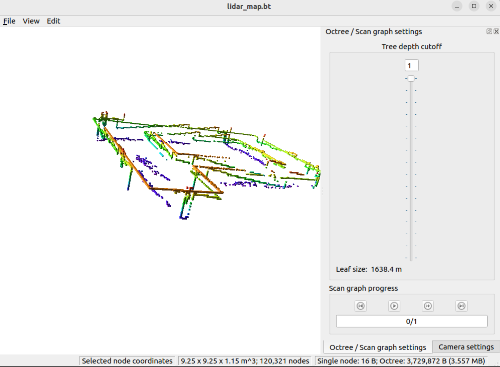
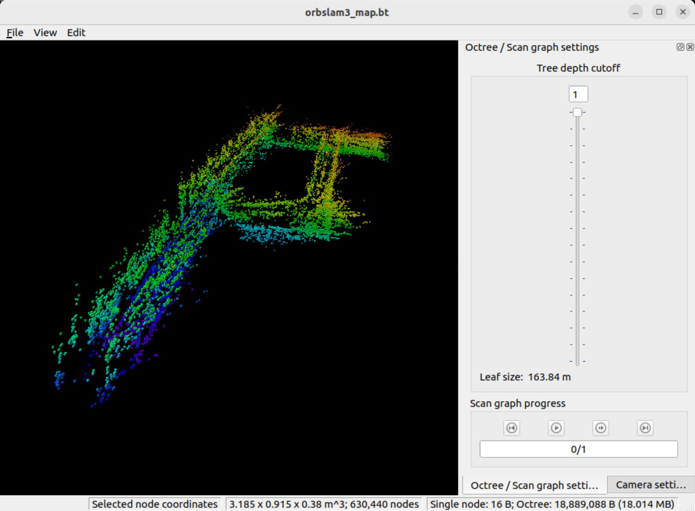

# Viewing the Saved OctoMap (`map.bt`)

This repository includes a pre-generated **OctoMap** file (`map.bt`) that represents a 3D occupancy grid built using ROS 2 and OctoMap Server.

##  Quick Instructions (for Ubuntu + ROS 2 Humble)

1. **Install the OctoMap visualisation tool:**
   ```bash
   sudo apt update
   sudo apt install ros-humble-octovis
   ```

2. **Open the map file:**
   ```bash
   octovis map.bt
   ```

This will launch the **OctoMap Viewer (OctoVis)** GUI, allowing you to explore the 3D voxel map interactively — you can zoom, rotate, and toggle occupied/free voxels.

---

## Notes

- The file `map.bt` must be in your current working directory when running the command, or you can specify its full path, e.g.:
  ```bash
  octovis /path/to/map.bt
  ```


---

## Preview







---

