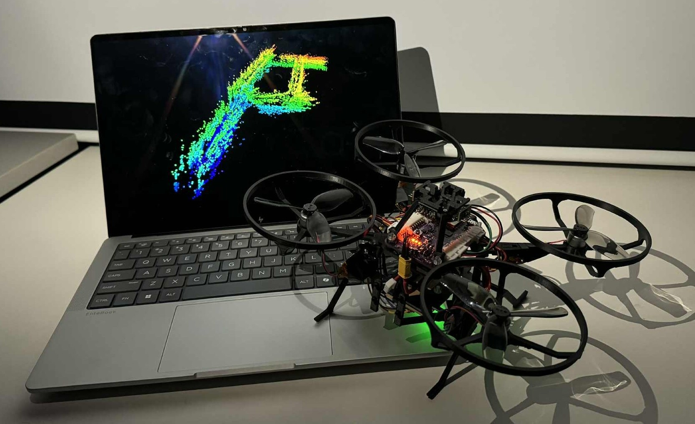
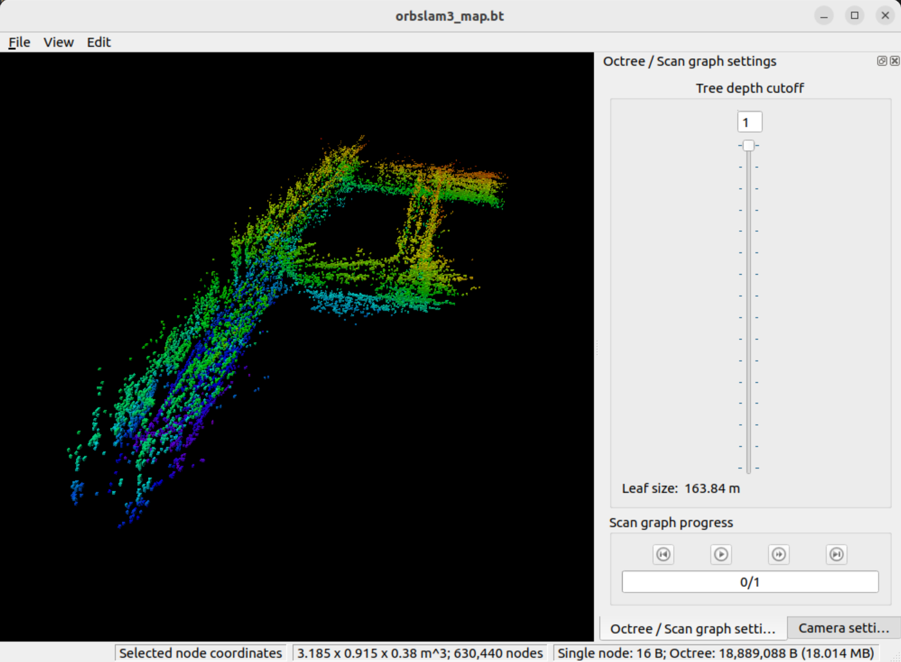
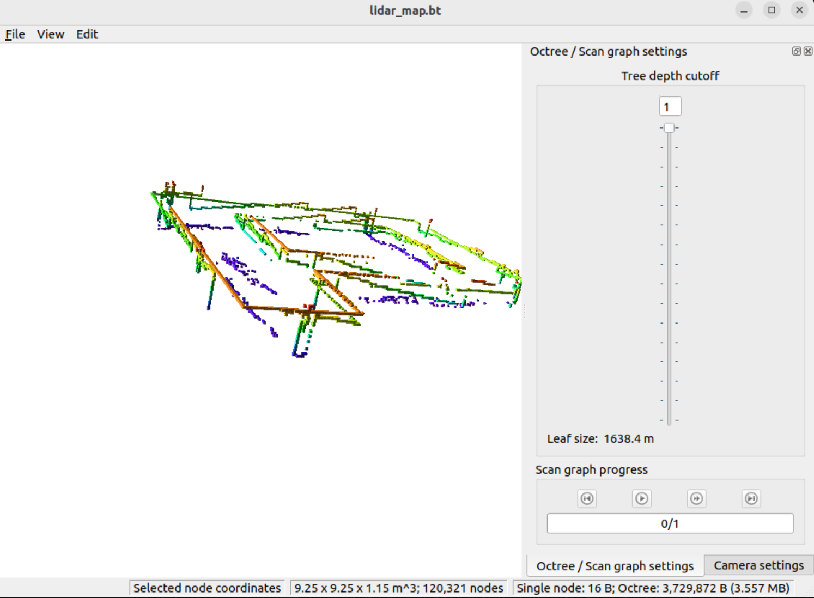

# ELEC5550 3D Mapping and Navigating Autonomous Drone
This is the repository for Team 0-05's final year design project for ELEC5550. The project is to build a drone system capable of autonomously mapping indoor spaces in 3D using onboard sensors, while meeting restrictive power and cost constraints (a 2S 800mAh battery and a $500 budget). Navigation is done using ROS2, running on a ground station connected to the drone over Wi-Fi. Mapping is also done on ROS2, based on UZ-SLAMLab's implementation of ORB-SLAM3 for Visual SLAM and Kimberly McGuire's crazyflie_ros2_multiranger repository for the ToF mapping. The flight controller is based on Espressif's ESP-Drone library, which itself is based on Bitcraze's Crazyflie flight kernel.

# Key features 
- Visual SLAM 3D mapping using a monocular Raspberry Pi Camera 3
- Navigation and mapping using an omnidirectional VL53L1 ToF lidar array
- Onboard obstacle avoidance
- Automatic emergency landing procedure for communication loss or critically low battery events.
- Integration with ROS with the option for manual control

# Requirement Verification Evidence
### Test VSM-02: ORB-SLAM3 and Lidar Map
The maps are exported as OctoMap files (.bt). Examples can be found under the `Examples` folder.

ORB-SLAM3             |  ToF Array
:-------------------------:|:-------------------------:
  |  

### Test LDR-02: Real-time mapping using the ToF array

### Test FC-04: Obstacle Avoidance

### Test FC-05: Communication Loss Emergency Landing
The critical battery event follows the same landing procedure, triggering 5 seconds after the event is detected.

# Issues
- Cheap 1104 BLDC motors overheating after ~40 seconds of flight time.
- Significant positional drift while publishing velocity commands.
- ORB-SLAM3 map is not scaled correctly.
- Optical Flow Deck could not be manufactured easily. A VL53L1 breakout board and a PMW3901 breakout board were used for the demonstration.

# Future Work
- Upgrading the FC MCU from an ESP32-S3 to an ESP32-P4. This MCU has hardware H.264 encoding, allowing us to remove the Raspberry Pi and hence vastly reduce the size and weight of the platform.
- Upgrading from visual SLAM to a visual-inertial SLAM using the IMU data for improved map accuracy.
- Changing frame to a more stiff carbon frame (the 3D printed ABS frame is quite flexible, although its unclear if the stability is actually affected by this)
- Custom BLDC ESCs mounted in a more secure location
- Frontier exploration scheme to deterministically map an entire space.
- Improve manufacturability of Optical Flow Deck by extending the pads of the PMW3901 and VL53L1 sensors out from beneath of the component.

# Licence
- Firmware: The firmware folder content is licensed under LGPL-3.0

- Software: The software folder content is released under GPLv3. The dependencies in this workspace are listed below. For a full list of the dependency's licenses, refer to their documentation.
    - ORB-SLAM3 (released under GPLv3)
    - Kimberley McGuire's lidar mapping project (released under the MIT License)

- Hardware: The hardware folder content is licensed under CC-BY-NC-SA 4.0

- Frame: The frame content is licensed under CC-BY-NC-SA 4.0